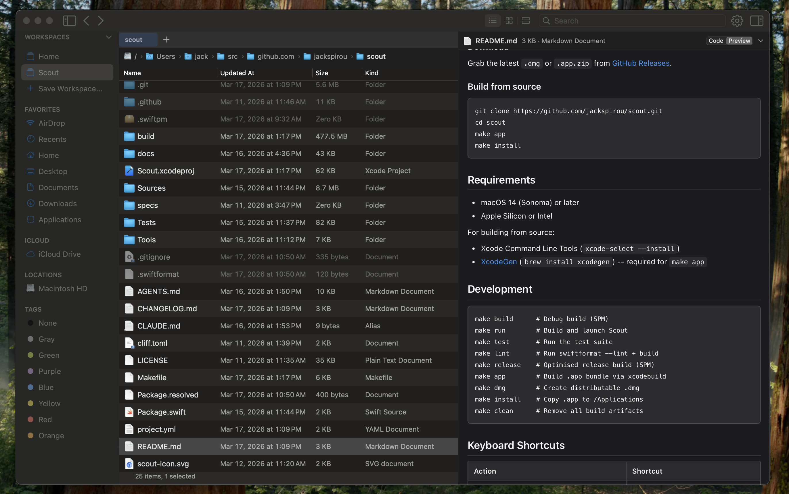

# Scout

A native macOS file manager built with Swift and AppKit.

[](https://github.com/jackspirou/scout/actions/workflows/ci.yml)
[](LICENSE)

Scout replaces Finder for power users who want true cut-and-paste, tabbed
browsing with session memory, and keyboard-first navigation.



## Features

- True cut/copy/move (Cmd+X/C/V) with undo support
- Tabbed browsing with per-tab selection and scroll memory
- Inline preview pane for images, text, audio, video, PDFs, and archives
- Persistent per-folder view settings (list, icon grid, column browser)
- Command palette (Cmd+Shift+P)
- Named workspaces -- save and restore window layouts
- Session restore -- tabs, selections, and scroll positions on relaunch
- Scoped search with searchfs(2) for instant filename matching
- Batch rename
- Get Info panel with permissions editor
- Connect to Server for network volumes
- Global hotkey (Opt+Space) to summon Scout from anywhere

## Install

### Homebrew

```
brew install --cask jackspirou/tap/scout
```

### Download

Grab the latest `.dmg` or `.app.zip` from
[GitHub Releases](https://github.com/jackspirou/scout/releases).

### Build from source

```
git clone https://github.com/jackspirou/scout.git
cd scout
make app
make install
```

## Requirements

- macOS 14 (Sonoma) or later
- Apple Silicon or Intel

For building from source:

- Xcode Command Line Tools (`xcode-select --install`)
- [XcodeGen](https://github.com/yonaskolb/XcodeGen) (`brew install xcodegen`) -- required for `make app`

## Development

```
make build      # Debug build (SPM)
make run        # Build and launch Scout
make test       # Run the test suite
make lint       # Run swiftformat --lint + build
make release    # Optimised release build (SPM)
make app        # Build .app bundle via xcodebuild
make dmg        # Create distributable .dmg
make install    # Copy .app to /Applications
make clean      # Remove all build artifacts
```

## Keyboard Shortcuts

| Action                  | Shortcut         |
|-------------------------|------------------|
| Toggle preview pane     | Cmd+Shift+Space  |
| Cut                     | Cmd+X            |
| Copy                    | Cmd+C            |
| Paste / Move            | Cmd+V            |
| Command palette         | Cmd+Shift+P      |
| Search                  | Cmd+F            |
| New tab                 | Cmd+T            |
| Close tab               | Cmd+W            |
| Next tab                | Ctrl+Tab         |
| Previous tab            | Ctrl+Shift+Tab   |
| Go to parent directory  | Cmd+Up           |
| Open selected item      | Enter            |
| Quick Look preview      | Space            |
| Toggle hidden files     | Cmd+Shift+.      |
| Rename                  | F2               |
| Delete                  | Cmd+Backspace    |
| New folder              | Cmd+Shift+N      |
| Path bar editing        | Cmd+L            |
| Save workspace          | Ctrl+Cmd+S       |
| Summon Scout            | Opt+Space        |

## License

Scout is licensed under the [GNU Affero General Public License v3.0](LICENSE).

## Contributing

Contributions welcome! Please open an issue to discuss before submitting a PR.
